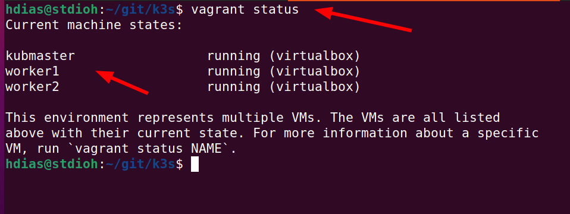
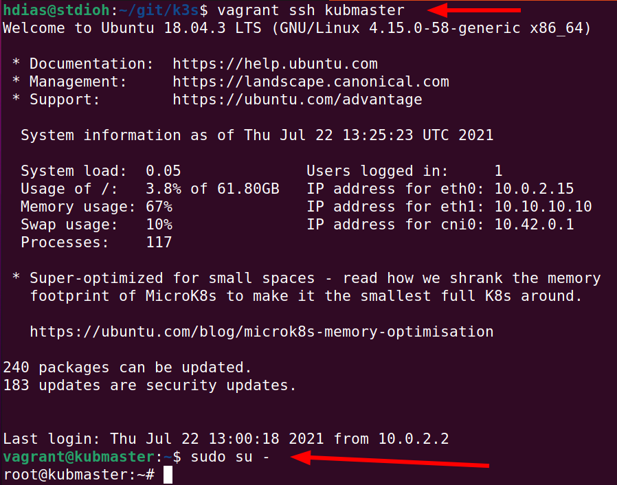
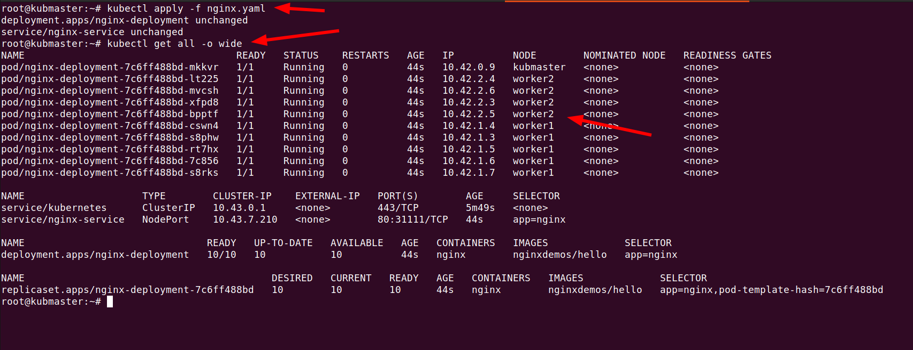
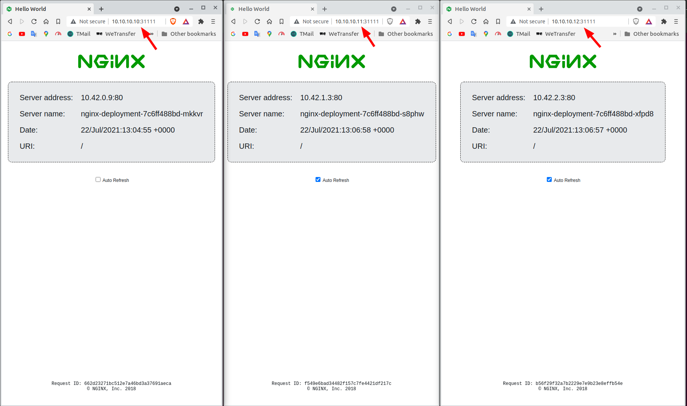

# Kubernetes K3S + Vagrant with Virtualbox
Testing Kubernetes K3S via Vagrant with Virtualbox.

In this project we run a K3S cluster using vagrant with 3 virtual machines with ubuntu, each one with the **k3s** installed.
One been the **master** and the other two as **workers**.

# Requirements
1. [Virtualbox](https://www.virtualbox.org/wiki/Downloads)
2. [Vagrant](https://www.vagrantup.com/downloads)
   
# Setup
```sh
git clone https://github.com/stdioh321/k3s.git
cd k3s
```

# Run
```sh
vagrant up
# It may take a while to complete.
# When its is finished, run the following command
vagrant status
```
The 3 vms should be up and running.




<h2>**** <b>Each vm has a static ip</b> ****</h2>
 
> kubmaster: 10.10.10.10
> 
> worker1: 10.10.10.11
> 
> worker2: 10.10.10.12


Now it's time to run our kubernetes commands.

Let's access the node master.
```sh
vagrant ssh kubmaster
# Now inside the vm kubmaster become the root

sudo su -
# You should be the root right now

kubectl get nodes
# It will display all the nodes
```
|Root | Nodes |
|:--|:--|
| | |

To test the cluster, there is a YAML file with a deployment and service of a nginx server.


```sh
kubctl apply -f nginx.yaml
# After some time check where they are running
kubctl get pods -o wide
```
The nginx YAML file is set to use 20 replicas, they should be spread on all the nodes.




<h2>*** Test time ***</h2>

Back in your machine open your browser at any of the following hosts:

>Kubmaster: http://10.10.10.10:31111

>Worker1: http://10.10.10.11:31111

>Worker2: http://10.10.10.12:31111

**They all should respond with a nginx page.



<h2>*** All Done ***</h2>
<h3>Have fun with it.</h3>
<br />  
<br />  


# References
* [Youtube: NetworkChuck](https://www.youtube.com/watch?v=X9fSMGkjtug)
* [K3S](https://k3s.io/)
* [Rancher](https://rancher.com/docs/k3s/latest/en/)
* [Kubernetes](https://kubernetes.io/)
* [Vagrant](https://www.vagrantup.com/)
* [Virtualbox](https://www.virtualbox.org/)